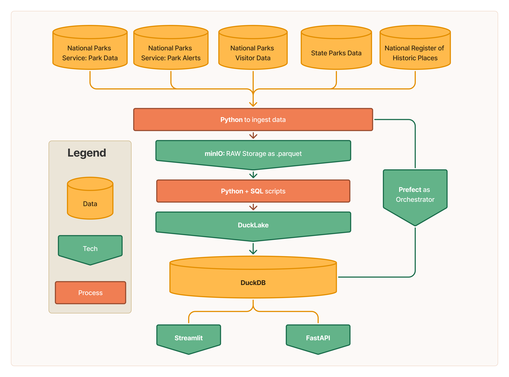

# NomadIQ Navigator
End-to-end data engineering demo of the medallion model, transforming datasets through Bronze, Silver, and Gold layers with DuckDB and DuckLake as the backbone.

## What is This Project?
Ever planned a trip to a bucket list park, only to miss hidden gems along the way? This project builds a unified analytics platform for U.S. National Parks, National Landmarks, and nearby State Parks. It consolidates scattered data sources, like:

- National Parks Service Parks Data
- NPS Alerts and Road Events
- NPS historic visitor stats
- National Register of Historic Places
- State Park datasets

 The result: richer insights to help outdoor enthusiasts find the best places and the best times to visit.

Public data is ingested, validated, and standardized into analysis-ready tables following a modern lakehouse architecture and medallion ELT pattern. The project highlights:

- End-to-end pipeline design with raw → staged → cleaned layers  
- Lightweight analytics/testing with DuckDB + DuckLake  
- Automated validation and data quality checks  
- Reusable, modular code for future extensions  
- Outputs suitable for dashboards, visualization, or cloud warehouse integration  

The repository features pipeline scripts, orchestration, and an API. 

## 🛠️ Project Flow



## System Architecture

|Technology | Purpose/Role |
|-------------|--------------|
| | Main programming language|
| | HTTP requests for data ingestion|
| | Environment variable management|
| | Workflow orchestration|
| | Object storage (S3-compatible)|
| | Analytical database engine|
| | Lakehouse storage and management|
| | DataFrame library for fast processing |
|  | Query language for analytics and transformations |
| | CI/CD automation|
| | Unit testing framework|
| | Containerization and environment|


## Installation & Local Development
1. **Clone the repository**:
``` bash
git clone https://github.com/jwhyteBNA/NomadIQ-Navigator.git
cd NomadIQ-Navigator
```

2. **Create and activate a Python virtual environment**:
``` bash
python -m venv venv
source venv/bin/activate
```

3. **Install dependencies**:
``` bash
pip install -r requirements.txt
```

4. **Set up environment variables**:
Copy .env.example to .env and fill in the required values, or create a .env file with your credentials and endpoints.

5. **Start services with Docker Compose**:
``` bash
docker compose up -d
```

6. **Run unit tests (optional, recommended)**:
``` bash
pytest
```

7. **Run the Prefect flow locally (for development)**:
``` bash
export PREFECT_API_URL="http://localhost:4200/api"
python src/ducklake_pipeline.py
```
Or trigger a deployment from the Prefect UI or CLI.

8. **Access the Prefect dashboard**:
Open http://localhost:4200 in your browser.

9. **Stop services**:
``` bash
docker compose down
```

## Running the Project

### 1. Start the FastAPI Backend

```sh
uvicorn api.api_server:app --reload
```
- The API will be available at http://localhost:8000

### 2. Launch the Main Dashboard

```sh
streamlit run src/streamlit_dashboard.py --server.port 8502
```
- Access the dashboard at http://localhost:8502

### 3. Launch the Compact Dashboard

```sh
streamlit run src/streamlit_dashboard_compact.py --server.port 8503
```
- Access the compact dashboard at http://localhost:8503

---